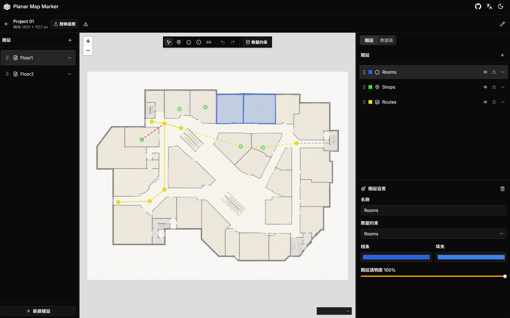

# Planar Map Marker
[简体中文](#简体中文) | [English](#english)

## 简体中文

> 这是一个自用的纯Vibe Coding项目，代码我没有仔细审阅过，介意的话请勿使用~

这是一个基于 Leaflet Simple CRS 的，纯前端的**平面地图标点系统**。  
您可以自己上传楼层底图 (PNG、JPEG、WebP、SVG )，并且在上面做标注，导出为GeoJSON。      
您可以用它来给画好的室内地图提供室内导航所需的数据，标记POI兴趣点，圈定区域范围...   

我们旨在让项目保持简单，易于上手，减少漫长的准备工作和学习成本~  
点击这里立即体验: [planar-map-marker.erduotong.com](https://planar-map-marker.erduotong.com/)  

如果你喜欢这个项目的话，可以给个star⭐吗 ( 
### 特性

- 多个楼层，每个楼层支持多个图层
- 点 / 多边形 / 路网规划三种标注类型
- 路网支持跨楼层连接
- 给图层创建类似QGIS的数据约束，可以在表格内编辑当前图层的所有数据（支持7种字段类型：文本 / 数字 / 开关 / 枚举 / 日期 / 颜色)
- 纯前端应用，数据保存在IndexedDB内
- 导出为GeoJSON，每个图层一个文件
- 导出一个项目的所有配置并且在新的浏览器内导入，便于迁移
- 支持100步撤销/重做（Ctrl+Z / Ctrl+Shift+Z）
- 多语言支持（目前支持中文和英文）

### 快速上手

1. **访问应用** 打开[planar-map-marker.erduotong.com](https://planar-map-marker.erduotong.com/)
2. **创建一个新项目**
3. **创建一个楼层，并上传一张底图（要求后续上传的底图分辨率一致）**
4. **建立图层和数据表**
   - 创建不同的图层（例如：洗手间、建筑、商铺......）
   - （可选）在 `数据约束`菜单中创建一个数据约束，为图层选择数据约束
5. **开始标注**
   - 使用菜单栏中的 点/多边形/放置节点和边 工具在地图上绘制
   - 单击标注物，在侧边栏填写具体属性
   - Tips: **路线图层**连边时候的节点可以选择当前图层内的节点，也可以选择其他**任何**一个**点图层**内的点（**可以跨楼层**）
6. **导入和导出**
   - 在顶部菜单栏导出当前项目为GeoJSON压缩包，可以在业务系统里使用
   - 也可以导出为 `.mappkg` 项目包，其中打包了关于当前项目的所有配置信息。此时您可在其他任何一台电脑上导入项目，完全复现导出时候的状态。

### 数据存储提示
本项目没有后端，**所有内容均存储在浏览器的IndexedDB中**

请不要使用无痕模式或清除浏览器缓存，这有概率让您的数据丢失。    
程序已尽力向浏览器申请不要删除您的数据，但可能会被浏览器拒绝。  
因此，建议**每天都使用导出功能进行备份**。

## English

> This is a pure Vibe Coding project for personal use. I haven't reviewed the code thoroughly, so please use it at your own discretion~

This is a pure front-end **Planar Map Marking System** based on Leaflet Simple CRS.  
You can upload your own floor plans (PNG, JPEG, WebP, SVG), draw markers on them, and export the data as GeoJSON.    
You can use it to provide indoor navigation data for your drawn indoor maps, mark POIs (Points of Interest), delineate areas, and more...  

We aim to keep the project simple and easy to get started, reducing tedious preparation and learning costs.   
Click here to experience it now: [planar-map-marker.erduotong.com](https://planar-map-marker.erduotong.com/)  

If you find this useful, I'd really appreciate a star⭐!

### Features

- Multiple floors, with support for multiple layers per floor.  
- Three annotation types: Point / Polygon / Route network planning.  
- Route networks support cross-floor connections.  
- Create QGIS-like data constraints for layers, and edit all data of the current layer within a table (Supports 7 field types: Text / Number / Switch / Enum / Date / Color).
- Pure front-end application, data is stored in IndexedDB.
- Export as GeoJSON, one file per layer.
- Export all configurations of a project and import them into a new browser for easy migration.
- Supports 100 steps of Undo/Redo (Ctrl+Z / Ctrl+Shift+Z).
- Multi-language support (Chinese and English currently)

### Get Started

1. **Access the App:** Open [planar-map-marker.erduotong.com](https://planar-map-marker.erduotong.com/)
2. **Create a new project.**
3. **Create a floor** and upload a base map (Note: Subsequently uploaded base maps must maintain the same resolution).
4. **Set up layers and data tables:**
    - Create different layers (e.g., Restrooms, Buildings, Shops...).
    - (Optional) Create a data constraint in the `Data Constraints` menu and apply it to a layer.
5. **Start marking:**
    - Use the Point / Polygon / Place Node & Edge tools in the menu bar to draw on the map.
    - Click on a marker and fill in its specific properties in the sidebar.
    - *Tips:* When connecting edges in a **Route Layer**, you can select nodes within the current layer, or points from **ANY** other **Point Layer** (**Cross-floor is supported**).
6. **Import and Export:**
    - Export the current project as a GeoJSON zip file from the top menu bar, which can be directly used in your business systems.
    - You can also export it as a `.mappkg` project package, which bundles all configuration info of the current project. You can then import this package on any other computer to completely restore the exact state at the time of export.

### Tips for Data Storage
This project has no backend. **All content is stored in the browser's IndexedDB.**

Please do not use Incognito/Private mode or clear your browser cache, as this may cause your data to be lost.
The program attempts to prevent data deletion, but this request may still be denied by the browser.
Therefore, it is highly recommended to **use the export function to back up your data daily**.